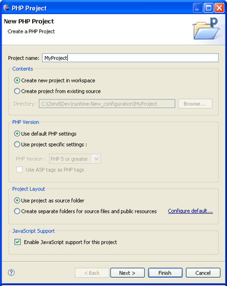

# Creating PHP Projects

<!--context:creating_php_projects-->

PHP projects are the containers within which all PHP and other application files should be created.

<!--ref-start-->

To create a new PHP project:

 1. From the menu bar, go to **File | New | PHP Project**  -Or- In PHP Explorer view, right-click and select **New | PHP Project**.  The New PHP Project wizard is displayed.   
 1. Enter the following information:
    * Project name - The required project name
    * Contents - Select whether to:
     * Create a new project in the workspace - Creates a new PHP project in the workspace directory.
     * Create a project from existing source - Creates a PHP project pointing to files situated outside of the workspace.  Click **Browse** to select the required source content.
    * PHP Version - Select whether to:
     * Use default PHP settings - Uses the default PHP Interpreter settings.
     * Use project specific settings - Select the PHP version to be used for the project and whether ASP tags are used as PHP tags.  See [PHP Version Support](../016-concepts/008-php_support.md) for more information
    * Project Layout - Select whether to:
     * Use project as source folder - All resources within the project will be added to the Build Path by default.
     * Create separate folders for source files and public resources - Separate folders will be created in which you can place resources which should be included or excluded from the Build Path.  See [Configuring a Project's PHP Build Path](176-configuring_build_paths.md) for more information.The default setting for this option can be configured from the [New Project Layout Preferences](../032-reference/032-preferences/048-new_project_layout_preferences.md) page.
    * JavaScript Support - Mark the 'Enable JavaScript support for this project' checkbox for JavaScript functionality (e.g. JavaScript Content Assist options) to be available to the project.  See [Enabling JavaScript Support in PHP Projects](../024-tasks/208-using_javascript/008-enabling_javascript_support_in_php_projects.md) for more information.
 2. Click **Next** to [configure the project's Include Path](168-adding_elements_to_a_project_s_include_path.md) (this can also be done following the project creation).
 3. Click **Next** to [configure the project's PHP Build Path](176-configuring_build_paths.md) (this can also be done following project creation).
 4. Click **Finish**.

The new PHP project will be created in your workspace and displayed in [PHP Explorer View](../032-reference/008-php_perspectives_and_views/008-php_perspective_views/008-php_explorer_view.md).

You can now start to develop your application by [creating PHP Files](../024-tasks/016-file_creation/000-index.md) or adding other resources to your project.

<!--ref-end-->

<!--links-start-->

#### Related Links:

 * [Creating Projects and Files](../008-getting_started/016-basic_tutorial/008-creating_and_uploading_a_project.md)
 * [Getting Started](../008-getting_started/000-index.md)
 * [Creating PHP Files](../024-tasks/016-file_creation/000-index.md)
 * [PHP Build Path](../016-concepts/152-build_paths.md)
 * [PHP Include Paths](../016-concepts/144-include_paths.md)

<!--links-end-->
