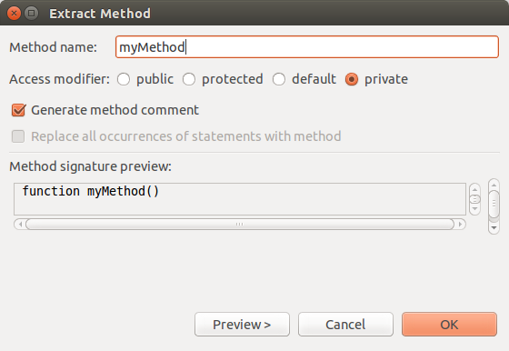

# Extracting Methods

<!--context:extracting_methods-->

The extract method feature can create a method to replace all occurrences of a given code fragment.

<!--ref-start-->

To create a new method from an expression:

1. In the editor, select the the code fragement which you would like to replace with a method.
2. Right-click and select **Refactor | Extract Method** -or- click **Alt+Shift+M**.  
   The Extract Method dialog is launched.
   
3. Enter the name of the new method in the Method name field.
4. Select the Access modifier for your method.
5. If multiple occurrences of the code fragement appear in your code, mark the 'replace all occurrences of statements with method' checkbox for all occurrences to be replaced with the new method.
6. Mark the Generate method comments checkbox for comments to be created for your method.
7. Click **OK** to apply your changes or click **Preview** if you want to see a preview of the changes that this refactoring will create.
8. If you clicked preview a preview window will open with a changes tree showing all the changes which will be made to reflect the extracting of the method.
9. The changes will be listed according to the context within which they appear. You can expand the nodes to see all changes within particular files, classes or functions.
10. Use the Next / Previous Change arrows  to scroll through all possible changes.  
   Unmarking the checkboxes next to the changes will cause those changes not to take effect.
11. Click **OK** to apply the changes.

The method will be extracted and the relevant changes made to the code.

<!--ref-end-->

<!--links-start-->

#### Related Links:

 * [Refactoring](../../016-concepts/076-refactoring.md)
 * [Using Refactoring](000-index.md)

<!--links-end-->